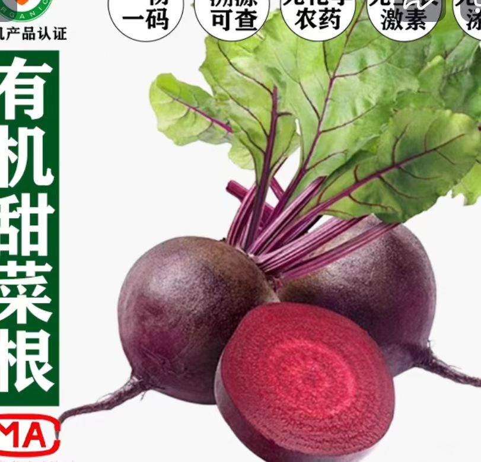
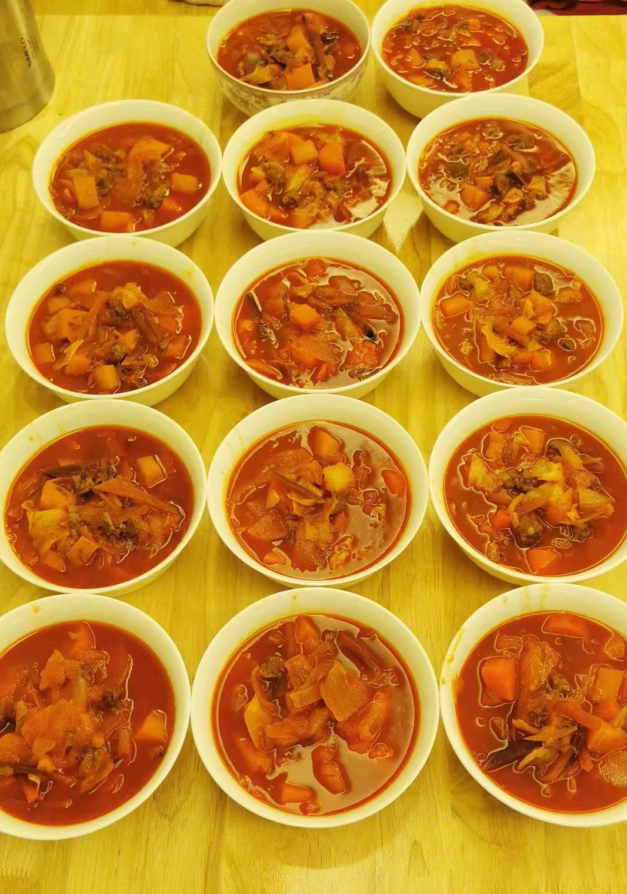

# smallfish2005的罗宋汤

## 做法
* 牛肋条2斤
  
  * 先汆水去沫后切小丁，然后炒至半熟，然后放入热水煮开后小火2小时至烂
  * 我从京东买的，澳洲牛肉肋条，你去搜一下就有

* 甜根菜（又叫红菜头）1斤

  * 这个是上色用的
  * 切丝炒半熟，操作时小心不要弄到衣服上，很难洗掉
  * 一般菜场没有的，我在天猫上买的，京东的不行，买20多元一斤的比较好，不放这个就做不出来东欧菜汤的色泽。

    

* 土豆2斤

  * 切丁

* 胡萝卜1斤

  * 切丁

* 包心菜2斤

  * 切好炒半熟

* 洋葱1.5斤

  * 切块，可不预炒，最后放入汤内，十几分钟就软化了

* 番茄酱1.3斤

  * 因为这个季节番茄不好吃，所以用番茄酱代替

* 白糖，盐若干

各位24童鞋见笑了：

## 原文链接
* [烧了2大锅罗宋汤](http://www.anjia818.win/forum.php?mod=viewthread&tid=256592&extra=page%3D1&page=1)
