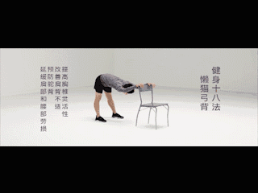
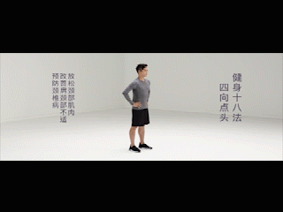
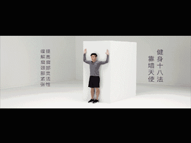

# 缓解颈椎紧张的3个方法

## 01 懒猫弓背

* 作用：提高胸椎灵活性，改善肩背不适，防止驼背，预防和延缓肩部和腰部劳损。
* 要领：每组6至10次，重复2至4组；整个练习过程中会有轻度酸痛和牵拉感，不应该有明显的疼痛。

## 02 四向点头

* 作用：放松颈部肌肉，改善肩颈部不适，预防颈椎病。
* 要领：每组5次，重复3至5组；前后左右四个方向点头，动作流畅缓慢，轻度酸痛和牵拉感。

## 03 靠墙摆臂

* 作用：提高肩部灵活性和肩胛稳定性，缓解肩颈部紧张。
* 要领
  1. 背部紧贴墙面，双手侧平举，向上屈肘90°，掌心朝前，将手臂完全贴住墙面。
  2. 同时手臂向上沿墙壁向上伸展，然后沿原路慢慢回到起始位置，重复进行；完成6至10次，重复2至4组。
