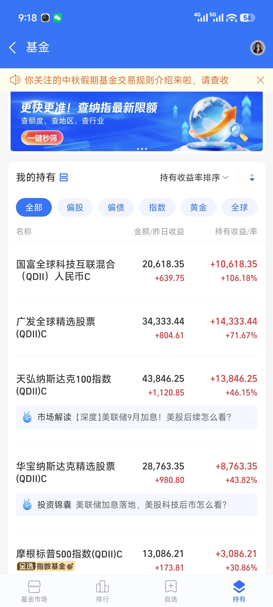

# 全球市场的基金的选择参考

* [“特努斯时代”开门红，苹果周二盘中股价创历史新高](https://m.ithome.com/html/1006060.htm)
* lxeeee 的评论（2026/09/23）

| 产品 |  金额 / 昨日收益 | 持有收益 / 率 |
| :--: | :--: | :--: |
| 国富全球科技互联混合(QDII)人民币C | 20,618.35 / +639.75 | +10,618.35 / +106.18% |
| 广发全球精选股票(QDII)C | 34,333.44 / +804.61 | +14,333.44 / +71.67% |
| 天弘纳斯达克100指数(QDII)C | 43,846.25 / +1,120.85 | +13,846.25 / +46.15% |
| 华宝纳斯达克精选股票(QDII)C | 28,763.35 / +980.80 | +8,763.35 / +43.82% |
| 摩根标普500指数(QDII)C | 13,086.21 / +173.81 | +3,086.21 / +30.86% |

* 

## 参考资料
* [“特努斯时代”开门红，苹果周二盘中股价创历史新高](https://m.ithome.com/html/1006060.htm)
